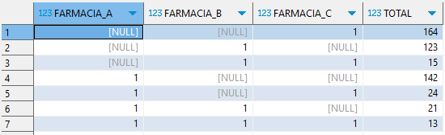
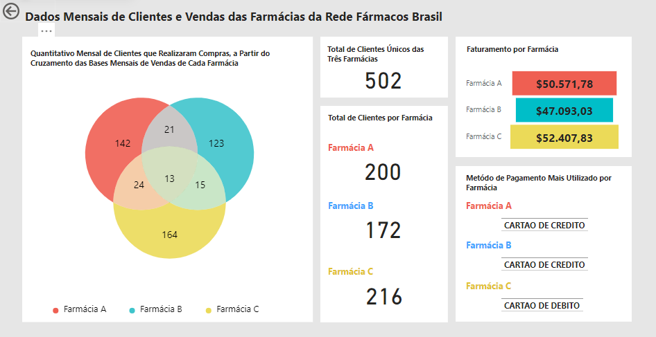
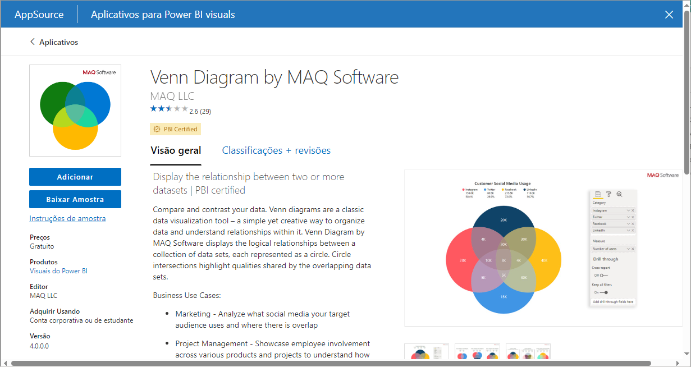

# case-farmacias

## Apresentação:
Este projeto apresenta um dashboard no Power BI que traz uma análise de dados mensais sobre os clientes de 3 filiais de uma rede de farmácias, como também alguns alguns dados sobre as vendas. O foco principal é apresentar uma análise de clientes em comum entre as três farmácias, a partir do Gráfico de Venn. A escolha deste tipo de gráfico se deu por sua fácil leitura ao abordar dados que se interseccionam entre diferentes tabelas. Neste "case" o dado escolhido foi o de código de cliente.

## Informações sobre o banco de dados:
O banco utilizado foi um SQL Server e é composto por 3 tabelas fatos (FARMACIA_A, FARMACIA_B, FARMACIA_C) que apresentam os registros de vendas do mês anterior de cada farmácia. Todas as 3 tabelas possuem a mesma estrutura e seus campos são descritos a seguir: 
* ID: identificação única de cada registro
* CODIGO_PEDIDO: código de identificação de venda
* CODIGO_CLIENTE: código de identificação única de cada cliente (a tabela dimensão de cadastro de clientes é irrelevante aqui, logo não foi adicionada)
* NOME_FARMACIA: identificação da filial da farmácia em que a venda foi realizada
* QUANTIDADE_PRODUTOS: quantidade de produtos da venda
* VALOR_COMPRA: valor total da venda
* METODO_PAGAMENTO: método de pagamento utilizado na venda

Exemplo de visualização de uma das tabelas:

Também foi adicionado um csv e código sql da view criada que será a base para a contrução do Gráfico de Venn.

Esse código faz as intersecções entre as três tabelas, a partir do campo CODIGO_CLIENTE, afim de encontrar os clientes em comum entre as bases e assim mapear onde cada um compra entre as três filiais. Cada número '1' indica que o total de clientes encontrados foi daquela respectiva coluna. Por exemplo, na linha 1 vemos um total de 164 clientes que compraram apenas na farmácia C no último mês. Já na linha 7 vemos um total de 13 clientes que fizeram pelo menos uma compra em cada uma das três farmácias no último mês.

Vale salientar que os dados apresentados são totalmente fictícios e foram exclusivamente criados por funções randômicas afim da execução deste projeto de estudo. Contudo, bases reais e públicas podem ser encontradas em diversos sites e serem utilizadas numa abordagem semelhante.

## Descrição do dashboard no Power BI:

Nosso dashboard é composto por 5 grupos de informações, que aqui chamaremos de painéis, que fornecem leituras importantes sobre a base de dados. No primeiro painel temos o Gráfico de Venn que apresenta a divisão de clientes que realizaram compras em cada farmácia ou num conjunto delas. Deste gráfico podemos extrair informações como, 123 apenas compraram na farmácia B, 24 pessoas compraram nas farmácias A e C e não compraram na B, ou 21 pessoas compraram nas farmácias A e B e não compraram na C. Esses sãos alguns exemplos da leitura que pode ser feita por meio deste gráfico.

O segundo painel ilustra um card totalizador de clientes distintos que compraram nas três farmácias durante aquele mês de vendas. Já o painel abaixo traz o total de clientes por farmácia, lembrando que as farmácias podem compartilhar clientes em comum. No painel de faturamento por farmácia temos a soma total em reais das vendas realizas em cada farmácia. E, por fim, no último painel temos o método de pagamento mais escolhido pelos clientes de cada farmácia.

Os dados foram importados no Power BI por meio de conexão da ferramenta com o banco e podem ser facilmente atualizados, caso haja alguma modificação nos dados de origem, sem afetar os painéis nem as medidas criadas, apenas atualizando os valores

O gráfico de Venn não é um gráfico padrão da seção de gráficos do Power BI, logo ele precisa ser feito download. A opção escolhida foi a indicada na figura seguinte.

